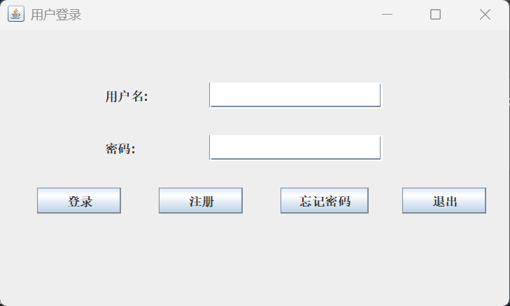
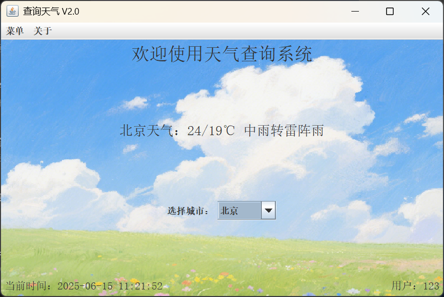

# 项目名称
天气查询系统

## 项目简介
天气查询系统是一款基于 Java Swing 的桌面应用程序，旨在为用户提供便捷的天气查询服务。用户可以通过登录系统查看当前城市的天气信息，并支持切换城市、修改背景图片等功能。系统采用模块化设计，易于扩展和维护。

## 项目采用技术

|技术|描述|
|-|-|
|Java Swing|用于实现桌面应用程序的图形用户界面 (GUI)。|
|MySQL|用于存储用户信息、城市编码和天气数据。|
|Maven|用于项目构建和依赖管理。|
|Jsoup|用于从天气网站抓取天气信息。|
|Git|用于版本控制和团队协作。|

## 功能需求分析
1. 用户管理
- 用户注册：支持用户注册，填写用户名、密码、密保问题和地区。
- 用户登录：验证用户名和密码，登录系统。
- 密码重置：通过密保问题验证后重置密码。
2. 天气查询
- 自动显示用户所在地区的天气信息。
- 支持切换城市，动态更新天气信息。
3. 界面设置
- 支持修改窗口大小（小、中、大）。
- 支持更改背景图片（春、夏、秋、冬）。
4. 数据管理
- 城市编码和天气信息存储在 MySQL 数据库中。
- 支持从数据库动态加载城市列表和天气信息。

## 项目亮点
1. 模块化设计：
- 用户管理、天气查询、界面设置等功能模块独立，便于维护和扩展。
2. 动态天气更新：
- 使用 Jsoup 从天气网站抓取实时天气信息，并存储到数据库中。
3. 个性化设置：
- 用户可以根据个人喜好调整窗口大小和背景图片。
4. 数据库集成：
- 使用 MySQL 存储用户信息和天气数据，确保数据持久化。
5. 团队协作：
- 使用 Git 进行版本控制，团队成员分工明确，协作高效。

## 主要功能截图

### 主要功能截图
1. 登录界面  
  <div align="center">
    
  </div>
2. 注册界面
  <div align="center">
    
  </div>
3. 修改密码界面
  <div align="center">
    
  </div>
4. 主页面  
  <div align="center">
    
  </div>
5. 其它功能  
  <div align="center">
    
  </div>

## 团队成员负责模块

|姓名|GitHub用户名|负责模块|主要工作|
|-|-|-|-|
|刘乐飞|LiXinGDBW|数据库与用户管理模块|数据库更新与修改，构建 DatabaseUtils 和 UserUtils，实现用户注册、登录、密码重置功能。|
|魏祥涵|suisuiyuanpingan|天气查询模块与工具类|构建 WeatherUtils，实现天气信息抓取、动态更新和显示功能；完成登录和注册界面设计。|
|张博文|ZBW-king|界面设置与背景管理模块|构建 BackgroundUtils，实现窗口大小调整、背景图片更改功能；完成关于背景图的功能实现。|

## 项目Git地址
[https://github.com/LiXinGDBW/WeatherApp](https://github.com/LiXinGDBW/WeatherApp)

## 成员github地址
- 刘乐飞：[https://github.com/LiXinGDBW](https://github.com/LiXinGDBW)
- 魏祥涵：[https://github.com/suisuiyuanpingan](https://github.com/suisuiyuanpingan)
- 张博文：[https://github.com/ZBW-king](https://github.com/ZBW-king)

# WeatherApp 项目源码目录

点击每个标题可展开/折叠源码内容，或直接在 GitHub 查看完整源码。

<details>
<summary><strong>src/main/java/main/App.java</strong></summary>

[查看源码（GitHub）](https://github.com/LiXinGDBW/WeatherApp/blob/main/src/main/java/main/App.java)

```java
package main;

import ui.LoginJFrame;

/**
 * 程序的入口类，负责启动整个应用程序。
 */
public class App {
    /**
     * 程序的主方法，程序从这里开始执行。
     * 
     * @param args 命令行参数，在本程序中未使用。
     * @throws Exception 如果在创建登录界面时发生异常。
     */
    public static void main(String[] args) throws Exception {
        // 创建一个登录界面的实例，启动登录流程
        new LoginJFrame();
    }
}
```
</details>

<details>
<summary><strong>src/main/java/ui/AppJFrame.java</strong></summary>

[查看源码（GitHub）](https://github.com/LiXinGDBW/WeatherApp/blob/main/src/main/java/ui/AppJFrame.java)

```java
// 只展示部分源码，完整内容请点击上方链接
package ui;

import javax.swing.*;

import utils.BackgroundUtils;
import utils.WeatherUtils;

import java.awt.event.*;
import java.awt.*;
import java.time.LocalDateTime;
import java.time.format.DateTimeFormatter;

// ... 省略内容 ...
```
</details>

<details>
<summary><strong>src/main/java/ui/LoginJFrame.java</strong></summary>

[查看源码（GitHub）](https://github.com/LiXinGDBW/WeatherApp/blob/main/src/main/java/ui/LoginJFrame.java)

```java
// 只展示部分源码，完整内容请点击上方链接
package utils;

import java.sql.*;
import javax.swing.JOptionPane;

// ... 省略内容 ...
```
</details>

<details>
<summary><strong>src/main/java/ui/RechangePasswordJFrame.java</strong></summary>

[查看源码（GitHub）](https://github.com/LiXinGDBW/WeatherApp/blob/main/src/main/java/ui/RechangePasswordJFrame.java)

```java
// 只展示部分源码，完整内容请点击上方链接
package utils;

import java.sql.*;
import javax.swing.JOptionPane;

// ... 省略内容 ...
```
</details>

<details>
<summary><strong>src/main/java/ui/RegisterJFrame.java</strong></summary>

[查看源码（GitHub）](https://github.com/LiXinGDBW/WeatherApp/blob/main/src/main/java/ui/RegisterJFrame.java)

```java
// 只展示部分源码，完整内容请点击上方链接
package utils;

import java.sql.*;
import javax.swing.JOptionPane;

// ... 省略内容 ...
```
</details>

<details>
<summary><strong>src/main/java/utils/UserUtils.java</strong></summary>

[查看源码（GitHub）](https://github.com/LiXinGDBW/WeatherApp/blob/main/src/main/java/utils/UserUtils.java)

```java
// 只展示部分源码，完整内容请点击上方链接
package utils;

import java.sql.*;
import javax.swing.JOptionPane;

// ... 省略内容 ...
```
</details>

<details>
<summary><strong>src/main/java/utils/WeatherUtils.java</strong></summary>

[查看源码（GitHub）](https://github.com/LiXinGDBW/WeatherApp/blob/main/src/main/java/utils/WeatherUtils.java)

```java
// 只展示部分源码，完整内容请点击上方链接
package utils;

import java.sql.*;
import java.util.ArrayList;
import java.util.List;

// ... 省略内容 ...
```
</details>

---
