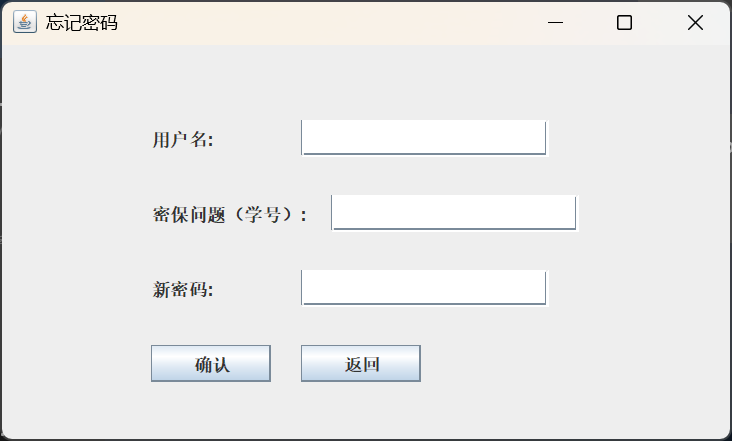

# 项目名称
天气查询系统

## 项目简介
天气查询系统是一款基于 Java Swing 的桌面应用程序，旨在为用户提供便捷的天气查询服务。用户可以通过登录系统查看当前城市的天气信息，并支持切换城市、修改背景图片等功能。系统采用模块化设计，易于扩展和维护。

## 项目采用技术

|技术|描述|
|-|-|
|Java Swing|用于实现桌面应用程序的图形用户界面 (GUI)。|
|MySQL|用于存储用户信息、城市编码和天气数据。|
|Maven|用于项目构建和依赖管理。|
|Jsoup|用于从天气网站抓取天气信息。|
|Git|用于版本控制和团队协作。|

## 功能需求分析
1. 用户管理
- 用户注册：支持用户注册，填写用户名、密码、密保问题和地区。
- 用户登录：验证用户名和密码，登录系统。
- 密码重置：通过密保问题验证后重置密码。
2. 天气查询
- 自动显示用户所在地区的天气信息。
- 支持切换城市，动态更新天气信息。
3. 界面设置
- 支持修改窗口大小（小、中、大）。
- 支持更改背景图片（春、夏、秋、冬）。
4. 数据管理
- 城市编码和天气信息存储在 MySQL 数据库中。
- 支持从数据库动态加载城市列表和天气信息。

## 项目亮点
1. 模块化设计：
- 用户管理、天气查询、界面设置等功能模块独立，便于维护和扩展。
2. 动态天气更新：
- 使用 Jsoup 从天气网站抓取实时天气信息，并存储到数据库中。
3. 个性化设置：
- 用户可以根据个人喜好调整窗口大小和背景图片。
4. 数据库集成：
- 使用 MySQL 存储用户信息和天气数据，确保数据持久化。
5. 团队协作：
- 使用 Git 进行版本控制，团队成员分工明确，协作高效。

## 主要功能截图

### 主要功能截图
1. 登录界面  
  <div align="center">
    
  </div>
2. 注册界面
  <div align="center">
    
  </div>
3. 修改密码界面
  <div align="center">
    
  </div>
4. 主页面  
  <div align="center">
    
  </div>
5. 其它功能  
  <div align="center">
    
  </div>

## 团队成员负责模块

|姓名|GitHub用户名|负责模块|主要工作|
|-|-|-|-|
|刘乐飞|LiXinGDBW|数据库与用户管理模块|数据库更新与修改，构建 DatabaseUtils 和 UserUtils，实现用户注册、登录、密码重置功能。|
|魏祥涵|suisuiyuanpingan|天气查询模块与工具类|构建 WeatherUtils，实现天气信息抓取、动态更新和显示功能；完成登录和注册界面设计。|
|张博文|ZBW-king|界面设置与背景管理模块|构建 BackgroundUtils，实现窗口大小调整、背景图片更改功能；完成关于背景图的功能实现。|

## 项目Git地址
[https://github.com/LiXinGDBW/WeatherApp](https://github.com/LiXinGDBW/WeatherApp)

## 成员github地址
- 刘乐飞：[https://github.com/LiXinGDBW](https://github.com/LiXinGDBW)
- 魏祥涵：[https://github.com/suisuiyuanpingan](https://github.com/suisuiyuanpingan)
- 张博文：[https://github.com/ZBW-king](https://github.com/ZBW-king)

# WeatherApp 项目源码目录

点击每个标题可展开/折叠源码内容，或直接在 GitHub 查看完整源码。

<details>
<summary><strong>src/main/java/main/App.java</strong></summary>

[查看源码（GitHub）](https://github.com/LiXinGDBW/WeatherApp/blob/main/src/main/java/main/App.java)

```java
package main;

import ui.LoginJFrame;

/**
 * 程序的入口类，负责启动整个应用程序。
 */
public class App {
    /**
     * 程序的主方法，程序从这里开始执行。
     * 
     * @param args 命令行参数，在本程序中未使用。
     * @throws Exception 如果在创建登录界面时发生异常。
     */
    public static void main(String[] args) throws Exception {
        // 创建一个登录界面的实例，启动登录流程
        new LoginJFrame();
    }
}
```
</details>

<details>
<summary><strong>src/main/java/ui/AppJFrame.java</strong></summary>

[查看源码（GitHub）](https://github.com/LiXinGDBW/WeatherApp/blob/main/src/main/java/ui/AppJFrame.java)

```java
package ui;

import javax.swing.*;

import utils.BackgroundUtils;
import utils.WeatherUtils;

import java.awt.event.*;
import java.awt.*;
import java.time.LocalDateTime;
import java.time.format.DateTimeFormatter;

/**
 * 主应用界面类，继承自 JFrame，用于创建天气查询系统的主窗口。
 */
public class AppJFrame extends JFrame {

    // 用户信息
    private String username;
    private String region;
    private String background;

    /**
     * 构造函数，初始化主应用界面并使其可见。
     * 
     * @param userInfo 包含用户信息的字符串数组，如用户名、地区、背景图片等。
     */
    public AppJFrame(String[] userInfo) {

        // 获取用户信息
        this.username = userInfo[0];
        this.region = userInfo[1];
        this.background = userInfo[2];

        // 初始化界面
        initJFrame();
        // 初始化菜单栏
        initJMenuBar();
        // 设置窗口可见
        setVisible(true);
    }

    // 背景面板
    private BackgroundPanel backgroundPanel;

    /**
     * 初始化 JFrame 的方法，包括设置窗口标题、大小、关闭操作、布局等，
     * 并添加标题、天气信息、城市选择区域和底部状态栏。
     */
    private void initJFrame() {
        // 设置窗口标题为“查询天气 V2.0”
        setTitle("查询天气 V2.0");
        // 设置窗口大小为 600x400 像素
        setSize(600, 400);
        // 设置窗口关闭时的操作，即退出程序
        setDefaultCloseOperation(JFrame.EXIT_ON_CLOSE);
        // 将窗口居中显示
        setLocationRelativeTo(null);
        // 设置窗口的布局管理器为 null，使用绝对定位
        setLayout(null);

        // 初始化背景面板
        backgroundPanel = new BackgroundPanel();
        // 设置窗口的内容面板为背景面板
        setContentPane(backgroundPanel);
        // 设置背景面板的背景图片
        backgroundPanel.setBackgroundImage(background);

        // 设置布局为 BorderLayout
        setLayout(new BorderLayout());

        // 中间内容区域
        JPanel contentPanel = new JPanel();

        // 使用 GridLayout 将内容分为三部分
        contentPanel.setLayout(new GridLayout(3, 1));
        // 设置内容面板为透明
        contentPanel.setOpaque(false);

        // 默认选中用户地区的天气信息
        String selectedRegion = region;

        // 创建标题区域
        JPanel titlePanel = new JPanel();
        // 设置标题区域的布局为 FlowLayout
        titlePanel.setLayout(new FlowLayout());
        // 设置标题区域为透明
        titlePanel.setOpaque(false);
        // 创建标题标签，显示“欢迎使用天气查询系统”
        JLabel titleLabel = new JLabel("欢迎使用天气查询系统");
        // 设置标题标签的字体为宋体，普通样式，大小为 24
        titleLabel.setFont(new Font("宋体", Font.PLAIN, 24));
        // 将标题标签添加到标题区域
        titlePanel.add(titleLabel);

        // 创建天气信息区域
        JPanel weatherPanel = new JPanel();
        // 设置天气信息区域的布局为 FlowLayout
        weatherPanel.setLayout(new FlowLayout());
        // 设置天气信息区域为透明
        weatherPanel.setOpaque(false);
        // 创建天气信息标签，显示“天气信息”
        JLabel weatherLabel = new JLabel("天气信息");
        // 设置天气信息标签的字体为宋体，普通样式，大小为 18
        weatherLabel.setFont(new Font("宋体", Font.PLAIN, 18));
        // 将天气信息标签添加到天气信息区域
        weatherPanel.add(weatherLabel);

        // 自动获取用户地区的天气信息
        String cityCode = WeatherUtils.getCityCode(selectedRegion);
        String weatherInfo = WeatherUtils.fetchWeatherInfo(cityCode);
        if (weatherInfo != null) {
            // 如果获取到天气信息，更新天气信息标签的文本
            weatherLabel.setText(selectedRegion + "天气：" + '\n' + weatherInfo);
        } else {
            // 如果未获取到天气信息，更新天气信息标签的文本
            weatherLabel.setText("当前地区天气获取失败！");
        }

        // 城市选择区域
        JPanel cityPanel = new JPanel();
        // 设置城市选择区域的布局为 FlowLayout
        cityPanel.setLayout(new FlowLayout());
        // 设置城市选择区域为透明
        cityPanel.setOpaque(false);
        // 创建城市选择标签，显示“选择城市：”
        JLabel cityLabel = new JLabel("选择城市：");
        // 调用 WeatherUtils 类的 loadCityNames 方法加载城市名称
        String[] cityNames = WeatherUtils.loadCityNames();
        // 创建城市选择下拉框
        JComboBox<String> cityComboBox = new JComboBox<>(cityNames);
        // 设置下拉框的默认选中项为用户所在地区
        cityComboBox.setSelectedItem(region);
        // 将城市选择标签添加到城市选择区域
        cityPanel.add(cityLabel);
        // 将城市选择下拉框添加到城市选择区域
        cityPanel.add(cityComboBox);

        // 为城市选择下拉框添加事件监听器
        cityComboBox.addActionListener(new ActionListener() {
            /**
             * 当城市选择下拉框的选项发生变化时执行的方法。
             * 
             * @param e 事件对象，包含事件的相关信息。
             */
            @Override
            public void actionPerformed(ActionEvent e) {
                // 获取用户选择的地区
                String selectedRegion = (String) cityComboBox.getSelectedItem();
                // 调用 WeatherUtils 类的 getCityCode 方法获取城市编码
                String cityCode = WeatherUtils.getCityCode(selectedRegion);
                // 调用 WeatherUtils 类的 fetchWeatherInfo 方法获取天气信息
                String weatherInfo = WeatherUtils.fetchWeatherInfo(cityCode);
                if (weatherInfo != null) {
                    // 如果获取到天气信息，更新天气信息标签的文本
                    weatherLabel.setText(selectedRegion + "天气：" + '\n' + weatherInfo);
                } else {
                    // 如果未获取到天气信息，更新天气信息标签的文本
                    weatherLabel.setText("天气信息获取失败！");
                }
            }
        });

        // 将标题、天气信息和城市选择区域添加到中间内容区域
        contentPanel.add(titlePanel);
        contentPanel.add(weatherPanel);
        contentPanel.add(cityPanel);

        // 将中间内容区域添加到主窗口的中央
        add(contentPanel, BorderLayout.CENTER);

        // 底部状态栏
        JPanel statusBar = new JPanel();
        // 设置底部状态栏的布局为 BorderLayout
        statusBar.setLayout(new BorderLayout());
        // 设置底部状态栏为透明
        statusBar.setOpaque(false);

        // 时间栏
        JPanel timePanel = new JPanel(new FlowLayout(FlowLayout.LEFT));
        // 设置时间栏为透明
        timePanel.setOpaque(false);
        // 创建时间标签
        JLabel timeLabel = new JLabel();
        // 设置时间标签的字体为宋体，普通样式，大小为 14
        timeLabel.setFont(new Font("宋体", Font.PLAIN, 14));
        // 将时间标签添加到时间栏
        timePanel.add(timeLabel);

        // 用户栏
        JPanel userPanel = new JPanel(new FlowLayout(FlowLayout.RIGHT));
        // 设置用户栏为透明
        userPanel.setOpaque(false);
        // 创建用户标签，显示当前用户的用户名
        JLabel userLabel = new JLabel("用户：" + username);
        // 设置用户标签的字体为宋体，普通样式，大小为 14
        userLabel.setFont(new Font("宋体", Font.PLAIN, 14));
        // 将用户标签添加到用户栏
        userPanel.add(userLabel);

        // 将时间栏和用户栏分别添加到底部状态栏的左右两侧
        statusBar.add(timePanel, BorderLayout.WEST);
        statusBar.add(userPanel, BorderLayout.EAST);

        // 定时器更新时间
        Timer timer = new Timer(1000, e -> {

            // 获取当前时间
            LocalDateTime now = LocalDateTime.now();

            // 格式化时间
            DateTimeFormatter formatter = DateTimeFormatter.ofPattern("yyyy-MM-dd HH:mm:ss");

            // 更新时间标签的文本
            timeLabel.setText("当前时间：" + now.format(formatter));
        });

        // 启动定时器
        timer.start();

        // 将底部状态栏添加到主窗口的底部
        add(statusBar, BorderLayout.SOUTH);
    }

    /**
     * 初始化菜单栏的方法，包括创建菜单、设置、返回登录、退出、关于等菜单项，并添加事件监听器。
     */
    private void initJMenuBar() {
        // 创建菜单栏
        JMenuBar jMenuBar = new JMenuBar();

        // 菜单栏
        JMenu menuJMenu = new JMenu("菜单");

        // 设置
        JMenuItem settingItem = new JMenuItem("设置");

        // 为设置菜单项添加事件监听器
        settingItem.addActionListener(new ActionListener() {
            /**
             * 当设置菜单项被点击时执行的方法。
             * 
             * @param e 事件对象，包含事件的相关信息。
             */
            @Override
            public void actionPerformed(ActionEvent e) {

                // 创建一个新的 JDialog 作为设置窗口
                JDialog settingsDialog = new JDialog(AppJFrame.this, "设置", true);
                // 设置设置窗口的大小为 400x400 像素
                settingsDialog.setSize(400, 400);
                // 将设置窗口居中显示
                settingsDialog.setLocationRelativeTo(AppJFrame.this);

                // 主界面
                JPanel panel = new JPanel();
                // 设置主界面的布局为 null，使用绝对定位
                panel.setLayout(null);

                // 窗口大小板块
                JLabel label = new JLabel("选择窗口大小：");
                // 设置窗口大小标签的位置和大小
                label.setBounds(20, 20, 150, 30);
                // 将窗口大小标签添加到主界面
                panel.add(label);

                // 创建单选按钮
                JRadioButton size1 = new JRadioButton("小窗口");
                // 设置小窗口单选按钮的位置和大小
                size1.setBounds(20, 60, 100, 30);
                JRadioButton size2 = new JRadioButton("中窗口");
                // 设置中窗口单选按钮的位置和大小
                size2.setBounds(20, 100, 100, 30);
                JRadioButton size3 = new JRadioButton("大窗口");
                // 设置大窗口单选按钮的位置和大小
                size3.setBounds(20, 140, 100, 30);

                // 将单选按钮添加到 sizeGroup
                ButtonGroup sizeGroup = new ButtonGroup();
                sizeGroup.add(size1);
                sizeGroup.add(size2);
                sizeGroup.add(size3);

                // 根据当前窗口大小设置默认选中项
                int currentWidth = AppJFrame.this.getWidth();
                int currentHeight = AppJFrame.this.getHeight();
                if (currentWidth == 600 && currentHeight == 400) {
                    size1.setSelected(true);
                } else if (currentWidth == 800 && currentHeight == 600) {
                    size2.setSelected(true);
                } else if (currentWidth == 1024 && currentHeight == 768) {
                    size3.setSelected(true);
                }

                // 将单选按钮添加到主界面
                panel.add(size1);
                panel.add(size2);
                panel.add(size3);

                // 背景图片选择
                JLabel backgroundLabel = new JLabel("选择背景图片：");
                // 设置背景图片选择标签的位置和大小
                backgroundLabel.setBounds(20, 200, 150, 30);
                // 将背景图片选择标签添加到主界面
                panel.add(backgroundLabel);

                JComboBox<String> backgroundComboBox = new JComboBox<>();
                // 设置背景图片选择下拉框的位置和大小
                backgroundComboBox.setBounds(20, 240, 200, 30);
                // 将背景图片选择下拉框添加到主界面
                panel.add(backgroundComboBox);
                // 添加背景图片选项
                backgroundComboBox.addItem("春天");
                backgroundComboBox.addItem("夏天");
                backgroundComboBox.addItem("秋天");
                backgroundComboBox.addItem("冬天");

                // 保存按钮
                JButton saveButton = new JButton("保存");
                // 设置保存按钮的位置和大小
                saveButton.setBounds(150, 300, 100, 30);
                // 为保存按钮添加事件监听器
                saveButton.addActionListener(event -> {
                    if (size1.isSelected()) {
                        // 如果选择小窗口，设置主窗口的大小为 600x400 像素
                        AppJFrame.this.setSize(600, 400);
                        if ("春天".equals(backgroundComboBox.getSelectedItem())) {
                            // 如果选择春天背景图片，设置背景面板的背景图片为“春小.png”
                            backgroundPanel.setBackgroundImage("春小.png");
                            // 调用 BackgroundUtils 类的 updateBackground 方法更新数据库中的背景图片信息
                            BackgroundUtils.updateBackground(username, "春小.png");
                        } else if ("夏天".equals(backgroundComboBox.getSelectedItem())) {
                            backgroundPanel.setBackgroundImage("夏小.png");
                            BackgroundUtils.updateBackground(username, "夏小.png");
                        } else if ("秋天".equals(backgroundComboBox.getSelectedItem())) {
                            backgroundPanel.setBackgroundImage("秋小.png");
                            BackgroundUtils.updateBackground(username, "秋小.png");
                        } else if ("冬天".equals(backgroundComboBox.getSelectedItem())) {
                            backgroundPanel.setBackgroundImage("冬小.png");
                            BackgroundUtils.updateBackground(username, "冬小.png");
                        }
                    } else if (size2.isSelected()) {
                        // 如果选择中窗口，设置主窗口的大小为 800x600 像素
                        AppJFrame.this.setSize(800, 600);
                        if ("春天".equals(backgroundComboBox.getSelectedItem())) {
                            backgroundPanel.setBackgroundImage("春中.png");
                            BackgroundUtils.updateBackground(username, "春中.png");
                        } else if ("夏天".equals(backgroundComboBox.getSelectedItem())) {
                            backgroundPanel.setBackgroundImage("夏中.png");
                            BackgroundUtils.updateBackground(username, "夏中.png");
                        } else if ("秋天".equals(backgroundComboBox.getSelectedItem())) {
                            backgroundPanel.setBackgroundImage("秋中.png");
                            BackgroundUtils.updateBackground(username, "秋中.png");
                        } else if ("冬天".equals(backgroundComboBox.getSelectedItem())) {
                            backgroundPanel.setBackgroundImage("冬中.png");
                            BackgroundUtils.updateBackground(username, "冬中.png");
                        }
                    } else if (size3.isSelected()) {
                        // 如果选择大窗口，设置主窗口的大小为 1024x768 像素
                        AppJFrame.this.setSize(1024, 768);
                        if ("春天".equals(backgroundComboBox.getSelectedItem())) {
                            backgroundPanel.setBackgroundImage("春大.png");
                            BackgroundUtils.updateBackground(username, "春大.png");
                        } else if ("夏天".equals(backgroundComboBox.getSelectedItem())) {
                            backgroundPanel.setBackgroundImage("夏大.png");
                            BackgroundUtils.updateBackground(username, "夏大.png");
                        } else if ("秋天".equals(backgroundComboBox.getSelectedItem())) {
                            backgroundPanel.setBackgroundImage("秋大.png");
                            BackgroundUtils.updateBackground(username, "秋大.png");
                        } else if ("冬天".equals(backgroundComboBox.getSelectedItem())) {
                            backgroundPanel.setBackgroundImage("冬大.png");
                            BackgroundUtils.updateBackground(username, "冬大.png");
                        }
                    }

                    // 刷新图片
                    revalidate();
                    repaint();

                    // 关闭设置窗口
                    settingsDialog.dispose();
                });
                // 将保存按钮添加到主界面
                panel.add(saveButton);
                // 将主界面添加到设置窗口
                settingsDialog.add(panel);
                // 设置设置窗口可见
                settingsDialog.setVisible(true);
            }
        });
        // 将设置菜单项添加到菜单中
        menuJMenu.add(settingItem);

        // 返回登录
        JMenuItem loginItem = new JMenuItem("返回登录");
        // 为返回登录菜单项添加事件监听器
        loginItem.addActionListener(new ActionListener() {
            /**
             * 当返回登录菜单项被点击时执行的方法。
             * 
             * @param e 事件对象，包含事件的相关信息。
             */
            @Override
            public void actionPerformed(ActionEvent e) {
                // 弹出确认对话框，询问用户是否确定返回登录界面
                int result = JOptionPane.showConfirmDialog(null, "确定要返回登录界面吗？", "返回确认", JOptionPane.YES_NO_OPTION);
                if (result == JOptionPane.YES_OPTION) {
                    // 如果用户选择是，创建登录界面的实例
                    new LoginJFrame();
                    // 关闭当前主窗口
                    dispose();
                }
            }
        });
        // 将返回登录菜单项添加到菜单中
        menuJMenu.add(loginItem);

        // 退出
        JMenuItem exitItem = new JMenuItem("退出");
        // 为退出菜单项添加事件监听器
        exitItem.addActionListener(new ActionListener() {
            /**
             * 当退出菜单项被点击时执行的方法。
             * 
             * @param e 事件对象，包含事件的相关信息。
             */
            @Override
            public void actionPerformed(ActionEvent e) {
                // 弹出确认对话框，询问用户是否确定退出
                int result = JOptionPane.showConfirmDialog(null, "确定要退出吗？", "退出确认", JOptionPane.YES_NO_OPTION);
                if (result == JOptionPane.YES_OPTION) {
                    // 如果用户选择是，退出程序
                    System.exit(0);
                }
            }
        });
        // 将退出菜单项添加到菜单中
        menuJMenu.add(exitItem);

        // 关于栏
        JMenu aboutJMenu = new JMenu("关于");
        JMenuItem version = new JMenuItem("版本");

        // 为关于版本菜单项添加事件监听器
        version.addActionListener(new ActionListener() {
            /**
             * 当关于版本菜单项被点击时执行的方法。
             * 
             * @param e 事件对象，包含事件的相关信息。
             */
            @Override
            public void actionPerformed(ActionEvent e) {
                // 弹出版本信息提示框
                JOptionPane.showMessageDialog(null, "天气查询系统\n版本 2.0", "版本", JOptionPane.INFORMATION_MESSAGE);
            }
        });
        JMenuItem author = new JMenuItem("作者");

        // 为关于作者菜单项添加事件监听器
        author.addActionListener(new ActionListener() {
            /**
             * 当关于作者菜单项被点击时执行的方法。
             * 
             * @param e 事件对象，包含事件的相关信息。
             */
            @Override
            public void actionPerformed(ActionEvent e) {
                // 弹出作者信息提示框
                JOptionPane.showMessageDialog(null, "作者\n计科24-2刘乐飞\n计科24-2魏祥涵\n计科24-2张博文", "作者",
                        JOptionPane.INFORMATION_MESSAGE);
            }
        });
        // 将版本和作者菜单项添加到关于栏中
        aboutJMenu.add(version);
        aboutJMenu.add(author);

        // 将菜单和关于栏添加到菜单栏中
        jMenuBar.add(menuJMenu);
        jMenuBar.add(aboutJMenu);
        // 设置窗口的菜单栏
        setJMenuBar(jMenuBar);
    }

    // 自定义背景面板
    private static class BackgroundPanel extends JPanel {
        private Image backgroundImage;

        /**
         * 设置背景图片的方法。
         * 
         * @param imagePath 背景图片的路径。
         */
        public void setBackgroundImage(String imagePath) {

            // 加载背景图片
            backgroundImage = new ImageIcon(getClass().getResource("/images/" + imagePath))
                    .getImage();
            // 重绘面板，更新背景图片
            repaint();
        }

        /**
         * 重写 paintComponent 方法，用于绘制背景图片。
         * 
         * @param g 图形上下文对象，用于绘制图形和文本。
         */
        @Override
        protected void paintComponent(Graphics g) {
            // 调用父类的 paintComponent 方法，确保面板的默认绘制行为
            super.paintComponent(g);

            // 绘制背景图片
            if (backgroundImage != null) {
                g.drawImage(backgroundImage, 0, 0, getWidth(), getHeight(), this);
            }
        }
    }
}
```
</details>

<details>
<summary><strong>src/main/java/ui/LoginJFrame.java</strong></summary>

[查看源码（GitHub）](https://github.com/LiXinGDBW/WeatherApp/blob/main/src/main/java/ui/LoginJFrame.java)

```java
package ui;

import javax.swing.*;

import utils.UserUtils;

import java.awt.event.ActionEvent;
import java.awt.event.ActionListener;

/**
 * 登录界面类，继承自 JFrame，用于创建用户登录窗口。
 */
public class LoginJFrame extends JFrame {
    /**
     * 构造函数，初始化登录界面并使其可见。
     */
    public LoginJFrame() {
        // 初始化 JFrame 的各项属性和组件
        initJFrame();
        // 设置窗口可见
        setVisible(true);
    }

    /**
     * 初始化 JFrame 的方法，包括设置窗口标题、大小、关闭操作、布局等，
     * 并添加用户名、密码输入框和各种按钮。
     */
    private void initJFrame() {
        // 设置窗口标题为“用户登录”
        setTitle("用户登录");
        // 设置窗口大小为 500x300 像素
        setSize(500, 300);
        // 设置窗口关闭时的操作，即退出程序
        setDefaultCloseOperation(JFrame.EXIT_ON_CLOSE);
        // 将窗口居中显示
        setLocationRelativeTo(null);
        // 设置窗口的布局管理器为 null，使用绝对定位
        setLayout(null);

        // 创建用户名标签，显示“用户名:”
        JLabel userLabel = new JLabel("用户名:");
        // 设置用户名标签的位置和大小
        userLabel.setBounds(100, 50, 80, 25);
        // 将用户名标签添加到窗口中
        add(userLabel);

        // 创建用户名输入框，初始长度为 20
        JTextField userText = new JTextField(20);
        // 设置用户名输入框的位置和大小
        userText.setBounds(200, 50, 165, 25);
        // 将用户名输入框添加到窗口中
        add(userText);

        // 创建密码标签，显示“密码:”
        JLabel passwordLabel = new JLabel("密码:");
        // 设置密码标签的位置和大小
        passwordLabel.setBounds(100, 100, 80, 25);
        // 将密码标签添加到窗口中
        add(passwordLabel);

        // 创建密码输入框，初始长度为 20
        JPasswordField passwordText = new JPasswordField(20);
        // 设置密码输入框的位置和大小
        passwordText.setBounds(200, 100, 165, 25);
        // 将密码输入框添加到窗口中
        add(passwordText);

        // 创建登录按钮，显示“登录”
        JButton loginButton = new JButton("登录");
        // 设置登录按钮的位置和大小
        loginButton.setBounds(36, 150, 80, 25);
        // 将登录按钮添加到窗口中
        add(loginButton);

        // 创建注册按钮，显示“注册”
        JButton registerButton = new JButton("注册");
        // 设置注册按钮的位置和大小
        registerButton.setBounds(152, 150, 80, 25);
        // 将注册按钮添加到窗口中
        add(registerButton);

        // 创建忘记密码按钮，显示“忘记密码”
        JButton forgetPasswordButton = new JButton("忘记密码");
        // 设置忘记密码按钮的位置和大小
        forgetPasswordButton.setBounds(268, 150, 84, 25);
        // 将忘记密码按钮添加到窗口中
        add(forgetPasswordButton);

        // 创建退出按钮，显示“退出”
        JButton exitButton = new JButton("退出");
        // 设置退出按钮的位置和大小
        exitButton.setBounds(384, 150, 80, 25);
        // 将退出按钮添加到窗口中
        add(exitButton);

        // 为登录按钮添加事件监听器
        loginButton.addActionListener(new ActionListener() {
            /**
             * 当登录按钮被点击时执行的方法。
             * 
             * @param e 事件对象，包含事件的相关信息。
             */
            @Override
            public void actionPerformed(ActionEvent e) {
                // 获取用户输入的用户名
                String username = userText.getText();
                // 获取用户输入的密码
                String password = new String(passwordText.getPassword());

                // 验证用户名和密码是否为空
                if (username.isEmpty() || password.isEmpty()) {
                    // 如果为空，弹出错误提示框
                    JOptionPane.showMessageDialog(null, "用户名或密码不能为空！", "错误", JOptionPane.ERROR_MESSAGE);
                    return;
                }
                // 调用 UserUtils 类的 validateUser 方法验证用户名和密码
                if (UserUtils.validateUser(username, password)) {
                    // 如果验证成功，弹出成功提示框
                    JOptionPane.showMessageDialog(null, "登录成功！", "成功", JOptionPane.INFORMATION_MESSAGE);
                    // 调用 UserUtils 类的 getUserInfo 方法获取用户信息
                    String[] userInfo = UserUtils.getUserInfo(username);
                    // 创建主应用界面的实例
                    new AppJFrame(userInfo);
                    // 关闭当前登录窗口
                    dispose();
                } else {
                    // 如果验证失败，弹出错误提示框
                    JOptionPane.showMessageDialog(null, "用户名或密码错误！", "错误", JOptionPane.ERROR_MESSAGE);
                }
            }
        });

        // 为注册按钮添加事件监听器
        registerButton.addActionListener(new ActionListener() {
            /**
             * 当注册按钮被点击时执行的方法。
             * 
             * @param e 事件对象，包含事件的相关信息。
             */
            @Override
            public void actionPerformed(ActionEvent e) {
                // 创建注册界面的实例
                new RegisterJFrame();
                // 关闭当前登录窗口
                dispose();
            }
        });

        // 为忘记密码按钮添加事件监听器
        forgetPasswordButton.addActionListener(new ActionListener() {
            /**
             * 当忘记密码按钮被点击时执行的方法。
             * 
             * @param e 事件对象，包含事件的相关信息。
             */
            @Override
            public void actionPerformed(ActionEvent e) {
                // 创建重置密码界面的实例
                new RechangePasswordJFrame();
                // 关闭当前登录窗口
                dispose();
            }
        });

        // 为退出按钮添加事件监听器
        exitButton.addActionListener(new ActionListener() {
            /**
             * 当退出按钮被点击时执行的方法。
             * 
             * @param e 事件对象，包含事件的相关信息。
             */
            @Override
            public void actionPerformed(ActionEvent e) {
                // 弹出确认对话框，询问用户是否确定退出
                int result = JOptionPane.showConfirmDialog(null, "确定要退出吗？", "退出确认", JOptionPane.YES_NO_OPTION);
                if (result == JOptionPane.YES_OPTION) {
                    // 如果用户选择是，则退出程序
                    System.exit(0);
                }
            }
        });
    }
}
```
</details>

<details>
<summary><strong>src/main/java/ui/RechangePasswordJFrame.java</strong></summary>

[查看源码（GitHub）](https://github.com/LiXinGDBW/WeatherApp/blob/main/src/main/java/ui/RechangePasswordJFrame.java)

```java
package ui;

import javax.swing.*;

import utils.UserUtils;

import java.awt.event.ActionEvent;
import java.awt.event.ActionListener;

/**
 * 重置密码界面类，继承自 JFrame，用于创建重置密码窗口。
 */
public class RechangePasswordJFrame extends JFrame {
    /**
     * 构造函数，初始化重置密码界面并使其可见。
     */
    public RechangePasswordJFrame() {
        // 初始化 JFrame 的各项属性和组件
        initJFrame();
        // 设置窗口可见
        setVisible(true);
    }

    /**
     * 初始化 JFrame 的方法，包括设置窗口标题、大小、关闭操作、布局等，
     * 并添加用户名、密保问题、新密码输入框和确认、返回按钮。
     */
    private void initJFrame() {
        // 设置窗口标题为“忘记密码”
        setTitle("忘记密码");
        // 设置窗口大小为 500x300 像素
        setSize(500, 300);
        // 设置窗口关闭时的操作，即退出程序
        setDefaultCloseOperation(JFrame.EXIT_ON_CLOSE);
        // 将窗口居中显示
        setLocationRelativeTo(null);
        // 设置窗口的布局管理器为 null，使用绝对定位
        setLayout(null);

        // 创建用户名标签，显示“用户名:”
        JLabel userLabel = new JLabel("用户名:");
        // 设置用户名标签的位置和大小
        userLabel.setBounds(100, 50, 80, 25);
        // 将用户名标签添加到窗口中
        add(userLabel);

        // 创建用户名输入框，初始长度为 20
        JTextField userText = new JTextField(20);
        // 设置用户名输入框的位置和大小
        userText.setBounds(200, 50, 165, 25);
        // 将用户名输入框添加到窗口中
        add(userText);

        // 创建密保问题标签，显示“密保问题（学号）:”
        JLabel securityQuestionLabel = new JLabel("密保问题（学号）:");
        // 设置密保问题标签的位置和大小
        securityQuestionLabel.setBounds(100, 100, 120, 25);
        // 将密保问题标签添加到窗口中
        add(securityQuestionLabel);

        // 创建密保问题输入框，初始长度为 20
        JTextField securityQuestionText = new JTextField(20);
        // 设置密保问题输入框的位置和大小
        securityQuestionText.setBounds(220, 100, 165, 25);
        // 将密保问题输入框添加到窗口中
        add(securityQuestionText);

        // 创建新密码标签，显示“新密码:”
        JLabel newPasswordLabel = new JLabel("新密码:");
        // 设置新密码标签的位置和大小
        newPasswordLabel.setBounds(100, 150, 80, 25);
        // 将新密码标签添加到窗口中
        add(newPasswordLabel);

        // 创建新密码输入框，初始长度为 20
        JTextField newPasswordText = new JTextField(20);
        // 设置新密码输入框的位置和大小
        newPasswordText.setBounds(200, 150, 165, 25);
        // 将新密码输入框添加到窗口中
        add(newPasswordText);

        // 创建确认按钮，显示“确认”
        JButton confirmButton = new JButton("确认");
        // 设置确认按钮的位置和大小
        confirmButton.setBounds(100, 200, 80, 25);
        // 将确认按钮添加到窗口中
        add(confirmButton);

        // 创建返回按钮，显示“返回”
        JButton backButton = new JButton("返回");
        // 设置返回按钮的位置和大小
        backButton.setBounds(200, 200, 80, 25);
        // 将返回按钮添加到窗口中
        add(backButton);

        // 为确认按钮添加事件监听器
        confirmButton.addActionListener(new ActionListener() {
            /**
             * 当确认按钮被点击时执行的方法。
             * @param e 事件对象，包含事件的相关信息。
             */
            @Override
            public void actionPerformed(ActionEvent e) {
                // 获取用户输入的用户名
                String username = userText.getText();
                // 获取用户输入的密保问题答案
                String securityQuestion = securityQuestionText.getText();
                // 获取用户输入的新密码
                String newPassword = newPasswordText.getText();

                // 验证输入是否为空
                if (username.isEmpty() || securityQuestion.isEmpty() || newPassword.isEmpty()) {
                    // 如果为空，弹出错误提示框
                    JOptionPane.showMessageDialog(null, "请填写所有字段！", "错误", JOptionPane.ERROR_MESSAGE);
                    return;
                }

                // 调用 UserUtils 类的 updatePassword 方法更新密码
                if (UserUtils.updatePassword(username, securityQuestion, newPassword)) {
                    // 如果更新成功，弹出成功提示框
                    JOptionPane.showMessageDialog(null, "密码重置成功！", "成功", JOptionPane.INFORMATION_MESSAGE);
                    // 创建登录界面的实例
                    new LoginJFrame(); 
                    // 关闭当前重置密码窗口
                    dispose(); 
                } else {
                    // 如果更新失败，弹出错误提示框
                    JOptionPane.showMessageDialog(null, "用户名或密保问题错误！", "错误", JOptionPane.ERROR_MESSAGE);
                }
            }
        });

        // 为返回按钮添加事件监听器
        backButton.addActionListener(new ActionListener() {
            /**
             * 当返回按钮被点击时执行的方法。
             * @param e 事件对象，包含事件的相关信息。
             */
            @Override
            public void actionPerformed(ActionEvent e) {
                // 创建登录界面的实例
                new LoginJFrame();
                // 关闭当前重置密码窗口
                dispose();
            }
        });
    }
}
```
</details>

<details>
<summary><strong>src/main/java/ui/RegisterJFrame.java</strong></summary>

[查看源码（GitHub）](https://github.com/LiXinGDBW/WeatherApp/blob/main/src/main/java/ui/RegisterJFrame.java)

```java
package ui;

import javax.swing.*;
import utils.DatabaseUtils;
import utils.WeatherUtils;
import java.awt.event.ActionEvent;
import java.awt.event.ActionListener;
import java.sql.*;

/**
 * 注册界面类，继承自 JFrame，用于创建用户注册窗口。
 */
public class RegisterJFrame extends JFrame {
    /**
     * 构造函数，初始化注册界面并使其可见。
     */
    public RegisterJFrame() {
        // 初始化 JFrame 的各项属性和组件
        initJFrame();
        // 设置窗口可见
        setVisible(true);
    }

    /**
     * 初始化 JFrame 的方法，包括设置窗口标题、大小、关闭操作、布局等，
     * 并添加用户名、密码、确认密码、密保问题、地区输入框和注册、返回按钮。
     */
    private void initJFrame() {
        // 设置窗口标题为“用户注册”
        setTitle("用户注册");
        // 设置窗口大小为 400x350 像素
        setSize(400, 350);
        // 设置窗口关闭时的操作，即退出程序
        setDefaultCloseOperation(JFrame.EXIT_ON_CLOSE);
        // 将窗口居中显示
        setLocationRelativeTo(null);
        // 设置窗口的布局管理器为 null，使用绝对定位
        setLayout(null);

        // 创建用户名标签，显示“用户名:”
        JLabel userLabel = new JLabel("用户名:");
        // 设置用户名标签的位置和大小
        userLabel.setBounds(40, 25, 125, 25);
        // 将用户名标签添加到窗口中
        add(userLabel);

        // 创建用户名输入框，初始长度为 20
        JTextField userText = new JTextField(20);
        // 设置用户名输入框的位置和大小
        userText.setBounds(160, 25, 165, 25);
        // 将用户名输入框添加到窗口中
        add(userText);

        // 创建密码标签，显示“密码:”
        JLabel passwordLabel = new JLabel("密码:");
        // 设置密码标签的位置和大小
        passwordLabel.setBounds(40, 75, 125, 25);
        // 将密码标签添加到窗口中
        add(passwordLabel);

        // 创建密码输入框，初始长度为 20
        JPasswordField passwordText = new JPasswordField(20);
        // 设置密码输入框的位置和大小
        passwordText.setBounds(160, 75, 165, 25);
        // 将密码输入框添加到窗口中
        add(passwordText);

        // 创建确认密码标签，显示“确认密码:”
        JLabel confirmPasswordLabel = new JLabel("确认密码:");
        // 设置确认密码标签的位置和大小
        confirmPasswordLabel.setBounds(40, 125, 125, 25);
        // 将确认密码标签添加到窗口中
        add(confirmPasswordLabel);

        // 创建确认密码输入框，初始长度为 20
        JPasswordField confirmPasswordText = new JPasswordField(20);
        // 设置确认密码输入框的位置和大小
        confirmPasswordText.setBounds(160, 125, 165, 25);
        // 将确认密码输入框添加到窗口中
        add(confirmPasswordText);

        // 创建密保标签，显示“密保问题（学号）:”
        JLabel securityQuestionLabel = new JLabel("密保问题（学号）:");
        // 设置密保标签的位置和大小
        securityQuestionLabel.setBounds(40, 175, 125, 25);
        // 将密保标签添加到窗口中
        add(securityQuestionLabel);

        // 创建密保问题输入框，初始长度为 20
        JTextField securityQuestionText = new JTextField(20);
        // 设置密保问题输入框的位置和大小
        securityQuestionText.setBounds(160, 175, 165, 25);
        // 将密保问题输入框添加到窗口中
        add(securityQuestionText);

        // 创建注册按钮，显示“注册”
        JButton registerButton = new JButton("注册");
        // 设置注册按钮的位置和大小
        registerButton.setBounds(80, 265, 80, 25);
        // 将注册按钮添加到窗口中
        add(registerButton);

        // 创建返回按钮，显示“返回”
        JButton backButton = new JButton("返回");
        // 设置返回按钮的位置和大小
        backButton.setBounds(240, 265, 80, 25);
        // 将返回按钮添加到窗口中
        add(backButton);

        // 创建地区标签，显示“地区:”
        JLabel regionLabel = new JLabel("地区:");
        // 设置地区标签的位置和大小
        regionLabel.setBounds(40, 215, 125, 25);
        // 将地区标签添加到窗口中
        add(regionLabel);

        // 调用 WeatherUtils 类的 loadCityNames 方法加载城市名称
        String[] cityNames = WeatherUtils.loadCityNames();
        // 创建地区选择框
        JComboBox<String> regionComboBox = new JComboBox<>(cityNames);
        // 添加默认选项“请选择地区”
        regionComboBox.addItem("请选择地区");
        regionComboBox.setSelectedItem("请选择地区");
        // 设置地区选择框的位置和大小
        regionComboBox.setBounds(160, 215, 165, 25);
        // 将地区选择框添加到窗口中
        add(regionComboBox);

        // 为注册按钮添加事件监听器
        registerButton.addActionListener(new ActionListener() {
            /**
             * 当注册按钮被点击时执行的方法。
             * 
             * @param e 事件对象，包含事件的相关信息。
             */
            @Override
            public void actionPerformed(ActionEvent e) {
                // 获取用户输入的用户名
                String username = userText.getText();
                // 获取用户输入的密码
                String password = new String(passwordText.getPassword());
                // 获取用户输入的确认密码
                String confirmPassword = new String(confirmPasswordText.getPassword());
                // 获取用户输入的密保问题答案
                String securityQuestionLabel = new String(securityQuestionText.getText());
                // 获取用户选择的地区
                String region = (String) regionComboBox.getSelectedItem();
                // 验证输入
                if (username.isEmpty() || password.isEmpty() || confirmPassword.isEmpty()
                        || securityQuestionLabel.isEmpty() || region.equals("请选择地区")) {
                    // 如果有输入为空，弹出错误提示框
                    JOptionPane.showMessageDialog(null, "所有字段均为必填项！", "错误", JOptionPane.ERROR_MESSAGE);
                    return;
                }

                if (!password.equals(confirmPassword)) {
                    // 如果两次输入的密码不一致，弹出错误提示框
                    JOptionPane.showMessageDialog(null, "两次输入的密码不一致！", "错误", JOptionPane.ERROR_MESSAGE);
                    return;
                }

                // 调用 registerUser 方法进行用户注册
                registerUser(username, password, securityQuestionLabel, region);
            }
        });

        // 为返回按钮添加事件监听器
        backButton.addActionListener(new ActionListener() {
            /**
             * 当返回按钮被点击时执行的方法。
             * 
             * @param e 事件对象，包含事件的相关信息。
             */
            @Override
            public void actionPerformed(ActionEvent e) {
                // 创建登录界面的实例
                new LoginJFrame();
                // 关闭当前注册窗口
                dispose();
            }
        });
    }

    /**
     * 用户注册的方法，将用户信息插入到数据库中。
     * 
     * @param username         用户的用户名。
     * @param password         用户的密码。
     * @param securityQuestion 用户的密保问题答案。
     * @param region           用户选择的地区。
     */
    private void registerUser(String username, String password, String securityQuestion, String region) {
        try (Connection conn = DatabaseUtils.getConnection()) {
            // SQL 插入语句，将用户信息插入到 users 表中
            String sql = "INSERT INTO users (username, password, security_question, region, background) VALUES (?, ?, ?, ?, ?)";
            // 创建预编译的 SQL 语句对象
            PreparedStatement stmt = conn.prepareStatement(sql);
            // 设置 SQL 语句的第一个参数为用户名
            stmt.setString(1, username);
            // 设置 SQL 语句的第二个参数为密码
            stmt.setString(2, password);
            // 设置 SQL 语句的第三个参数为密保问题答案
            stmt.setString(3, securityQuestion);
            // 设置 SQL 语句的第四个参数为地区
            stmt.setString(4, region);

            // 默认背景图片
            stmt.setString(5, "春小.png");

            // 执行插入操作
            stmt.executeUpdate();

            // 弹出注册成功的提示框
            JOptionPane.showMessageDialog(null, "注册成功！", "成功", JOptionPane.INFORMATION_MESSAGE);
            // 创建登录界面的实例
            new LoginJFrame();
            // 关闭当前注册窗口
            dispose();
        } catch (SQLException e) {
            // 弹出注册失败的提示框
            JOptionPane.showMessageDialog(null, "注册失败，数据库错误！", "错误", JOptionPane.ERROR_MESSAGE);
            // 打印异常堆栈信息
            e.printStackTrace();
        }
    }
}
```
</details>

<details>
<summary><strong>src/main/java/utils/BackgroundUtils.java</strong></summary>

[查看源码（GitHub）](https://github.com/LiXinGDBW/WeatherApp/blob/main/src/main/java/utils/BackgroundUtils.java)

```java
package utils;

import java.sql.*;

/**
 * 背景工具类，提供修改用户背景图片的方法。
 */
public class BackgroundUtils {
    /**
     * 修改文件默认背景图片的方法。
     * 
     * @param username      要修改背景图片的用户名。
     * @param newBackground 新的背景图片名称。
     */
    public static void updateBackground(String username, String newBackground) {
        // SQL 更新语句，根据用户名更新用户的背景图片信息
        String updateBackgroundSql = "UPDATE users SET background = ? WHERE username = ?";

        try (Connection conn = DatabaseUtils.getConnection();
                PreparedStatement stmt = conn.prepareStatement(updateBackgroundSql)) {

            // 设置 SQL 语句的第一个参数为新的背景图片名称
            stmt.setString(1, newBackground);
            // 设置 SQL 语句的第二个参数为用户名
            stmt.setString(2, username);

            // 执行更新操作，返回更新的行数
            int rowsUpdated = stmt.executeUpdate();

            if (rowsUpdated > 0) {
                // 如果更新成功，打印更新成功的信息
                System.out.println("背景图片更新成功: 用户名 " + username + " 新背景 " + newBackground);
            } else {
                // 如果更新失败，打印更新失败的信息
                System.err.println("背景图片更新失败: 用户名 " + username + " 不存在");
            }
        } catch (SQLException e) {
            // 打印异常堆栈信息
            e.printStackTrace();
            // 打印更新背景图片时发生错误的信息
            System.err.println("更新背景图片时发生错误！");
        }
    }
}
```
</details>

<details>
<summary><strong>src/main/java/utils/DatabaseUtils.java</strong></summary>

[查看源码（GitHub）](https://github.com/LiXinGDBW/WeatherApp/blob/main/src/main/java/utils/DatabaseUtils.java)

```java
package utils;

import java.sql.Connection;
import java.sql.DriverManager;
import java.sql.SQLException;

/**
 * 数据库工具类，提供获取数据库连接的方法。
 */
public class DatabaseUtils {
    // 数据库连接的 URL，指定数据库的地址和名称
    private static final String URL = "jdbc:mysql://10.173.9.33:3306/weather_app";
    // 数据库用户名，需要替换为实际的用户名
    private static final String USER = "app_user";
    // 数据库密码，需要替换为实际的密码
    private static final String PASSWORD = "123456";

    /**
     * 获取数据库连接的方法。
     * 
     * @return 一个数据库连接对象。
     * @throws SQLException 如果在获取数据库连接时发生 SQL 异常。
     */
    public static Connection getConnection() throws SQLException {
        // 使用 DriverManager 类的 getConnection 方法获取数据库连接
        return DriverManager.getConnection(URL, USER, PASSWORD);
    }
}
```
</details>

<details>
<summary><strong>src/main/java/utils/UserUtils.java</strong></summary>

[查看源码（GitHub）](https://github.com/LiXinGDBW/WeatherApp/blob/main/src/main/java/utils/UserUtils.java)

```java
package utils;

import java.sql.*;
import javax.swing.JOptionPane;

/**
 * 用户工具类，提供与用户相关的操作方法，如获取用户信息、验证用户、更新密码等。
 */
public class UserUtils {
    /**
     * 获取用户所有信息的方法。
     * 
     * @param username 要查询的用户名。
     * @return 包含用户信息的字符串数组，如用户名、地区、背景图片等；如果查询失败则返回 null。
     */
    public static String[] getUserInfo(String username) {
        try (Connection conn = DatabaseUtils.getConnection()) {
            // SQL 查询语句，根据用户名查询用户信息
            String sql = "SELECT username,region,background FROM users WHERE username = ?";
            // 创建预编译的 SQL 语句对象
            PreparedStatement stmt = conn.prepareStatement(sql);
            // 设置 SQL 语句的第一个参数为用户名
            stmt.setString(1, username);
            // 执行查询，获取结果集
            ResultSet resultSet = stmt.executeQuery();
            if (resultSet.next()) {
                // 如果结果集有数据，创建一个长度为 3 的字符串数组
                String[] userInfo = new String[3];
                // 将查询结果中的用户名赋值给数组的第一个元素
                userInfo[0] = resultSet.getString("username");
                // 将查询结果中的地区赋值给数组的第二个元素
                userInfo[1] = resultSet.getString("region");
                // 将查询结果中的背景图片赋值给数组的第三个元素
                userInfo[2] = resultSet.getString("background");
                return userInfo;
            }
            return null;
        } catch (SQLException e) {
            // 如果发生 SQL 异常，弹出错误提示框
            JOptionPane.showMessageDialog(null, "获取用户信息失败！", "错误", JOptionPane.ERROR_MESSAGE);
            // 打印异常堆栈信息
            e.printStackTrace();
            return null;
        }
    }

    /**
     * 验证用户名和密码的方法。
     * 
     * @param username 要验证的用户名。
     * @param password 要验证的密码。
     * @return 如果用户名和密码匹配则返回 true，否则返回 false。
     */
    public static boolean validateUser(String username, String password) {
        try (Connection conn = DatabaseUtils.getConnection()) {
            // SQL 查询语句，根据用户名和密码查询用户信息
            String sql = "SELECT * FROM users WHERE username = ? AND password = ?";
            // 创建预编译的 SQL 语句对象
            PreparedStatement stmt = conn.prepareStatement(sql);
            // 设置 SQL 语句的第一个参数为用户名
            stmt.setString(1, username);
            // 设置 SQL 语句的第二个参数为密码
            stmt.setString(2, password);
            // 执行查询，获取结果集
            ResultSet resultSet = stmt.executeQuery();

            // 如果结果集有数据，说明用户名和密码匹配，返回 true
            return resultSet.next();
        } catch (SQLException e) {
            // 如果发生 SQL 异常，弹出错误提示框
            JOptionPane.showMessageDialog(null, "数据库连接失败！", "错误", JOptionPane.ERROR_MESSAGE);
            // 打印异常堆栈信息
            e.printStackTrace();
        }
        return false;
    }

    /**
     * 验证密保并更新密码的方法。
     * 
     * @param username         要更新密码的用户名。
     * @param securityQuestion 用户输入的密保问题答案。
     * @param newPassword      新的密码。
     * @return 如果更新成功则返回 true，否则返回 false。
     */
    public static boolean updatePassword(String username, String securityQuestion, String newPassword) {
        // SQL 更新语句，根据用户名和密保问题答案更新用户密码
        String sql = "UPDATE users SET password = ? WHERE username = ? AND security_question = ?";
        try (Connection conn = DatabaseUtils.getConnection();
                PreparedStatement stmt = conn.prepareStatement(sql)) {
            // 设置 SQL 语句的第一个参数为新密码
            stmt.setString(1, newPassword);
            // 设置 SQL 语句的第二个参数为用户名
            stmt.setString(2, username);
            // 设置 SQL 语句的第三个参数为密保问题答案
            stmt.setString(3, securityQuestion);

            // 执行更新操作，返回更新的行数
            int rowsUpdated = stmt.executeUpdate();
            // 如果更新的行数大于 0，说明更新成功，返回 true
            return rowsUpdated > 0;
        } catch (SQLException e) {
            // 如果发生 SQL 异常，弹出错误提示框
            JOptionPane.showMessageDialog(null, "数据库操作失败！", "错误", JOptionPane.ERROR_MESSAGE);
            // 打印异常堆栈信息
            e.printStackTrace();
            return false;
        }
    }
}
```
</details>

<details>
<summary><strong>src/main/java/utils/WeatherInfoManager.java</strong></summary>

[查看源码（GitHub）](https://github.com/LiXinGDBW/WeatherApp/blob/main/src/main/java/utils/WeatherInfoManager.java)

```java
// package utils;

// import org.jsoup.Jsoup;
// import org.jsoup.nodes.Document;
// import org.jsoup.nodes.Element;
// import java.sql.*;
// import java.util.Scanner;

// /**
//  * 天气信息获取与管理系统
//  * 该程序通过网络爬虫从中国天气网获取城市天气信息，并将其存储在本地数据库中
//  * 支持天气信息更新、城市添加和删除等功能
//  */
// public class WeatherInfoManager {
//     /**
//      * 程序入口点
//      * 
//      * @param args 命令行参数
//      */
//     public static void main(String[] args) {
//         try (Scanner scanner = new Scanner(System.in)) {
//             // 主菜单循环，允许用户连续进行操作
//             while (true) {
//                 printMenu();
//                 int choice = getValidatedUserChoice(scanner);

//                 switch (choice) {
//                     case 1:
//                         updateWeatherInfo();
//                         System.out.println("天气信息更新完成！");
//                         break;
//                     case 2:
//                         addCity(scanner);
//                         System.out.println("城市添加完成！");
//                         break;
//                     case 3:
//                         deleteCity(scanner);
//                         System.out.println("城市删除完成！");
//                         break;
//                     case 4:
//                         System.out.println("程序已退出！");
//                         return;
//                     default:
//                         System.out.println("无效的选项，请重新输入！");
//                 }
//             }
//         } catch (Exception e) {
//             System.err.println("程序运行发生错误: " + e.getMessage());
//             e.printStackTrace();
//         }
//     }

//     /**
//      * 打印操作菜单
//      */
//     private static void printMenu() {
//         System.out.println("\n请选择操作：");
//         System.out.println("1. 更新天气信息");
//         System.out.println("2. 添加城市");
//         System.out.println("3. 删除城市");
//         System.out.println("4. 退出程序");
//         System.out.print("请输入选项(1-4): ");
//     }

//     /**
//      * 获取并验证用户输入的选项
//      * 
//      * @param scanner Scanner对象，用于读取用户输入
//      * @return 合法的选项值(1-4)
//      */
//     private static int getValidatedUserChoice(Scanner scanner) {
//         int choice = scanner.nextInt();
//         scanner.nextLine(); // 消耗换行符，避免影响后续输入
//         return choice;
//     }

//     /**
//      * 更新所有城市的天气信息
//      * 从数据库获取所有城市编码，然后通过网络爬虫获取对应的天气信息并更新到数据库
//      */
//     private static void updateWeatherInfo() {
//         // SQL查询语句：获取所有城市编码
//         String selectCityCodesSQL = "SELECT code FROM region_code";
//         // SQL更新语句：更新天气信息
//         String updateWeatherSQL = "UPDATE region_weather SET weather = ? WHERE code = ?";

//         try (Connection conn = DatabaseUtils.getConnection();
//                 PreparedStatement selectStmt = conn.prepareStatement(selectCityCodesSQL);
//                 PreparedStatement updateStmt = conn.prepareStatement(updateWeatherSQL)) {
//             int sum = 0;
//             // 查询所有城市的编码
//             try (ResultSet rs = selectStmt.executeQuery()) {
//                 // 遍历城市编码并获取天气信息
//                 while (rs.next()) {
//                     long cityCode = rs.getLong("code");
//                     String weather = fetchWeatherInfo(String.valueOf(cityCode));

//                     if (weather != null && !weather.isEmpty()) {
//                         // 更新天气信息到 region_weather 表
//                         updateStmt.setString(1, weather);
//                         updateStmt.setLong(2, cityCode);

//                         int rowsUpdated = updateStmt.executeUpdate();
//                         if (rowsUpdated > 0) {
//                             System.out.println("更新成功: 城市编码 " + cityCode + " 天气 " + weather);
//                             // 统计成功更新的记录数
//                             sum++;
//                         } else {
//                             System.err.println("更新失败: 城市编码 " + cityCode + "（可能不存在于 region_weather 表中）");
//                         }
//                     } else {
//                         System.err.println("未能获取城市编码 " + cityCode + " 的天气信息");
//                     }
//                 }
//                 System.out.println("共更新 " + sum + " 条天气记录。");
//             }
//         } catch (SQLException e) {
//             System.err.println("数据库操作错误: " + e.getMessage());
//             e.printStackTrace();
//         }
//     }

//     /**
//      * 根据城市编码从中国天气网获取天气信息
//      * 
//      * @param cityCode 城市编码
//      * @return 天气信息字符串，如果获取失败则返回null
//      */
//     private static String fetchWeatherInfo(String cityCode) {
//         try {
//             // 构造查询 URL，使用中国天气网的移动版页面
//             String url = "https://wap.weather.com.cn/mweather15d/" + cityCode + ".shtml";
//             // 模拟浏览器访问
//             Document doc = Jsoup.connect(url).get();

//             // 使用 CSS 选择器提取温度和天气状况元素
//             Element temperatureDiv = doc.selectFirst("div.h15listtem.h15k");
//             Element weatherElement = doc
//                     .selectFirst("div.h15listbody > ul > li:nth-child(1) > div.h15tiao > div:nth-child(2) > p");

//             // 提取文本内容，确保两个元素都存在时才返回有效数据
//             if (temperatureDiv != null && weatherElement != null) {
//                 return temperatureDiv.text() + " " + weatherElement.text();
//             } else {
//                 return "未找到目标元素";
//             }
//         } catch (Exception e) {
//             System.err.println("获取天气信息失败，城市编码: " + cityCode + ", 错误: " + e.getMessage());
//             return null;
//         }
//     }

//     /**
//      * 添加新城市到系统中
//      * 
//      * @param scanner Scanner对象，用于读取用户输入
//      */
//     private static void addCity(Scanner scanner) {
//         // 插入城市编码表的SQL语句
//         String insertCityCodeSQL = "INSERT INTO region_code (code, region) VALUES (?, ?)";
//         // 插入天气信息表的SQL语句
//         String insertWeatherSQL = "INSERT INTO region_weather (code) VALUES (?)";

//         try (Connection conn = DatabaseUtils.getConnection();
//                 PreparedStatement cityCodeStmt = conn.prepareStatement(insertCityCodeSQL);
//                 PreparedStatement weatherStmt = conn.prepareStatement(insertWeatherSQL)) {

//             System.out.print("请输入城市编码: ");
//             String cityCode = scanner.nextLine();
//             System.out.print("请输入城市名称: ");
//             String cityName = scanner.nextLine();

//             // 插入城市编码到 region_code 表
//             cityCodeStmt.setString(1, cityCode);
//             cityCodeStmt.setString(2, cityName);
//             int cityCodeInsertedRows = cityCodeStmt.executeUpdate();

//             // 插入天气记录到 region_weather 表
//             weatherStmt.setString(1, cityCode);
//             int weatherInsertedRows = weatherStmt.executeUpdate();

//             if (cityCodeInsertedRows > 0 && weatherInsertedRows > 0) {
//                 System.out.println("城市添加成功！");
//             } else {
//                 System.out.println("城市添加失败！");
//             }
//         } catch (SQLException e) {
//             System.err.println("添加城市失败: " + e.getMessage());
//             e.printStackTrace();
//         }
//     }

//     /**
//      * 从系统中删除指定城市
//      * 使用数据库事务确保数据一致性，先删除天气信息，再删除城市编码
//      * 
//      * @param scanner Scanner对象，用于读取用户输入
//      */
//     private static void deleteCity(Scanner scanner) {
//         // 删除天气信息表记录的SQL语句
//         String deleteWeatherSQL = "DELETE FROM region_weather WHERE code = ?";
//         // 删除城市编码表记录的SQL语句
//         String deleteCityCodeSQL = "DELETE FROM region_code WHERE code = ?";

//         try (Connection conn = DatabaseUtils.getConnection()) {
//             // 开启事务
//             conn.setAutoCommit(false);

//             try (PreparedStatement weatherStmt = conn.prepareStatement(deleteWeatherSQL);
//                     PreparedStatement cityCodeStmt = conn.prepareStatement(deleteCityCodeSQL)) {

//                 System.out.print("请输入要删除的城市编码: ");
//                 String cityCode = scanner.nextLine();

//                 // 先删除天气表中的记录
//                 weatherStmt.setString(1, cityCode);
//                 int weatherDeletedRows = weatherStmt.executeUpdate();

//                 // 再删除城市表中的记录
//                 cityCodeStmt.setString(1, cityCode);
//                 int cityCodeDeletedRows = cityCodeStmt.executeUpdate();

//                 // 提交事务
//                 conn.commit();

//                 if (cityCodeDeletedRows > 0) {
//                     System.out.println("城市删除成功！共删除 " + (weatherDeletedRows + cityCodeDeletedRows) + " 条记录");
//                 } else {
//                     System.out.println("城市删除失败！未找到对应城市编码");
//                 }
//             } catch (SQLException e) {
//                 // 回滚事务
//                 conn.rollback();
//                 System.err.println("删除城市失败: " + e.getMessage());
//                 e.printStackTrace();
//             } finally {
//                 // 恢复自动提交模式
//                 conn.setAutoCommit(true);
//             }
//         } catch (SQLException e) {
//             System.err.println("数据库连接错误: " + e.getMessage());
//             e.printStackTrace();
//         }
//     }
// }
```
</details>

<details>
<summary><strong>src/main/java/utils/WeatherUtils.java</strong></summary>

[查看源码（GitHub）](https://github.com/LiXinGDBW/WeatherApp/blob/main/src/main/java/utils/WeatherUtils.java)

```java
package utils;

import java.sql.*;
import java.util.ArrayList;
import java.util.List;

/**
 * 天气工具类，提供与天气信息相关的操作方法，如获取天气信息、加载城市名称、获取城市编码等。
 */
public class WeatherUtils {
    /**
     * 获取天气信息的方法。
     * 
     * @param cityCode 要查询的城市编码。
     * @return 该城市的天气信息；如果查询失败则返回“未知”或“错误”。
     */
    public static String fetchWeatherInfo(String cityCode) {
        // SQL 查询语句，根据城市编码查询天气信息
        String fetchWeatherSql = "SELECT weather FROM region_weather WHERE code = ?";

        try (Connection conn = DatabaseUtils.getConnection();
                PreparedStatement stmt = conn.prepareStatement(fetchWeatherSql)) {

            // 设置 SQL 语句的第一个参数为城市编码
            stmt.setString(1, cityCode);

            // 执行查询，获取结果集
            ResultSet resultSet = stmt.executeQuery();

            // 检查查询结果
            if (resultSet.next()) {
                // 如果结果集有数据，获取天气信息
                String weather = resultSet.getString("weather");
                // 打印查询成功的信息
                System.out.println("查询成功: 城市编码 " + cityCode + " 天气 " + weather);
                return weather;
            } else {
                // 如果结果集没有数据，打印未找到信息的错误信息
                System.err.println("未找到城市编码 " + cityCode + " 的天气信息");
                return "未知";
            }
        } catch (SQLException e) {
            // 打印异常堆栈信息
            e.printStackTrace();
            // 打印查询天气信息时发生错误的信息
            System.err.println("查询天气信息时发生错误！");
            return "错误";
        }
    }

    /**
     * 加载城市名称的方法。
     * 
     * @return 包含所有城市名称的字符串数组。
     */
    public static String[] loadCityNames() {
        // 创建一个存储城市名称的列表
        List<String> cityList = new ArrayList<>();
        // SQL 查询语句，从 region_code 表中查询所有地区名称
        String sql = "SELECT region FROM region_code";

        try (Connection conn = DatabaseUtils.getConnection();
                Statement stmt = conn.createStatement();
                ResultSet resultSet = stmt.executeQuery(sql)) {

            // 遍历结果集，将每个地区名称添加到列表中
            while (resultSet.next()) {
                cityList.add(resultSet.getString("region"));
            }
            // 打印成功加载的城市数量
            System.out.println("成功加载 " + cityList.size() + " 个城市");

        } catch (SQLException e) {
            // 打印异常堆栈信息
            e.printStackTrace();
        }

        // 将列表转换为数组并返回
        return cityList.toArray(new String[0]);
    }

    /**
     * 获取城市编码的方法。
     * 
     * @param selectedRegion 要查询的地区名称。
     * @return 该地区对应的城市编码；如果查询失败则返回 null。
     */
    public static String getCityCode(String selectedRegion) {
        // SQL 查询语句，根据地区名称查询城市编码
        String sql = "select code from region_code where region = ?";
        try (Connection conn = DatabaseUtils.getConnection()) {
            // 创建预编译的 SQL 语句对象
            PreparedStatement stmt = conn.prepareStatement(sql);
            // 设置 SQL 语句的第一个参数为地区名称
            stmt.setString(1, selectedRegion);
            // 执行查询，获取结果集
            ResultSet resultSet = stmt.executeQuery();
            if (resultSet.next()) {
                // 如果结果集有数据，获取城市编码并返回
                return resultSet.getString("code");
            } else {
                // 如果结果集没有数据，打印未找到城市编码的错误信息
                System.err.println("未找到地区对应的城市编码: " + selectedRegion);
                return null;
            }
        } catch (SQLException e) {
            // 打印异常堆栈信息
            e.printStackTrace();
            // 打印获取城市编码时发生错误的信息
            System.err.println("获取城市编码时发生错误: " + e.getMessage());
            return null;
        }
    }
}
```
</details>

---
